# Sơ đồ Design Patterns trong Story Reading System

Truy cập vào https://mermaid.live để vẽ diagram.

```mermaid
classDiagram
    
    %% 1. FACTORY PATTERN (Backend)
    namespace Factory_Pattern {
        class StoriesController {
            -IStoryService _storyService
            +CreateStory(dto: CreateStoryDto) Task
        }
        class IStoryService {
            <<DI_Interface>>
            +CreateStoryAsync(title, desc, categoryId) Task
        }
        class StoryService {
            -IStoryFactory _storyFactory
            +CreateStoryAsync(title, desc, categoryId) Task
        }
        class IStoryFactory {
            <<DI_Interface>>
            +CreateStory(categoryId: int) IStoryCategory
        }
        class StoryFactory {
            +CreateStory(categoryId: int) IStoryCategory
        }
        class IStoryCategory {
            <<abstract>>
            +abstract Validate() string
            +abstract GetSpecialFeature() string
        }
        class ActionStory {
            +Validate() string
            +GetSpecialFeature() string
        }
        class HorrorStory {
            +Validate() string
            +GetSpecialFeature() string
        }
        class RomanceStory { 
            +Validate() string 
            +GetSpecialFeature() string 
        }
        class DetectiveStory { 
            +Validate() string 
            +GetSpecialFeature() string 
        }
    }
    StoriesController --> IStoryService : "Inject via"
    IStoryService <|.. StoryService
    StoryService --> IStoryFactory : "Inject via"
    IStoryFactory <|.. StoryFactory
    ActionStory --|> IStoryCategory
    HorrorStory --|> IStoryCategory
    RomanceStory --|> IStoryCategory
    DetectiveStory --|> IStoryCategory
    StoryFactory --> IStoryCategory : "Creates"

    %% 2. SINGLETON PATTERN (Backend & Frontend)
    namespace Singleton_Pattern {
        class BE_ReadingProgressManager {
            -static instance: BE_ReadingProgressManager
            -BE_ReadingProgressManager()
            +static Instance$ BE_ReadingProgressManager
            +UpdateProgressAsync(userId: int, storyId: int, chapterId: int, position: int) Task
        }
        class FE_ReadingProgressManager {
            -static instance: FE_ReadingProgressManager
            +static getInstance() FE_ReadingProgressManager
            +update(storyId: int, chapterId: int, percentage: number) void
        }
    }

    %% 3. TEMPLATE METHOD PATTERN (Backend)
    namespace Template_Method_Pattern {
        class ReportsController {
            -IReportService _reportService
            +GetReport(authorId, type) Task
        }
        class IReportService {
            <<DI_Interface>>
            +GenerateReport(authorId, start, end, type) Task
        }
        class ReportService {
            +GenerateReport(authorId, start, end, type) Task
        }
        class AuthorReportTemplate {
            <<abstract>>
            +GenerateReportAsync(authorId: int, start: DateTime, end: DateTime) Task~byte[]~
            #abstract QueryDataAsync(authorId: int, start: DateTime, end: DateTime) Task~object~
            #abstract CalculateMetrics(rawData: object) object
            #abstract FormatReport(calculatedData: object) string
        }
        class RevenueReport {
            #QueryDataAsync(authorId: int, start: DateTime, end: DateTime) Task~object~
            #CalculateMetrics(rawData: object) object
            #FormatReport(calculatedData: object) string
        }
        class ViewGrowthReport {
            #QueryDataAsync(authorId: int, start: DateTime, end: DateTime) Task~object~
            #CalculateMetrics(rawData: object) object
            #FormatReport(calculatedData: object) string
        }
    }
    ReportsController --> IReportService : "Inject via"
    IReportService <|.. ReportService
    ReportService ..> AuthorReportTemplate : "Instantiates"
    AuthorReportTemplate <|-- RevenueReport
    AuthorReportTemplate <|-- ViewGrowthReport

    %% 4. STRATEGY PATTERN (Frontend)
    namespace Strategy_Pattern {
        class IReadingStrategy {
            <<interface>>
            +apply(container: HTMLElement) void
        }
        class DayScrollStrategy { 
            +apply(container: HTMLElement) void
        }
        class NightScrollStrategy { 
            +apply(container: HTMLElement) void
        }
        class DayFlipStrategy { 
            +apply(container: HTMLElement) void
        }
        class NightFlipStrategy { 
            +apply(container: HTMLElement) void
        }
        
        class ReaderContext {
            -strategy: IReadingStrategy
            +setStrategy(strategy: IReadingStrategy) void
            +setReadingMode(theme: string, nav: string) void
        }
    }
    IReadingStrategy <|.. DayScrollStrategy
    IReadingStrategy <|.. NightScrollStrategy
    IReadingStrategy <|.. DayFlipStrategy
    IReadingStrategy <|.. NightFlipStrategy
    ReaderContext --> IReadingStrategy

    %% 5. COMMAND PATTERN (Frontend)
    namespace Command_Pattern {
        class ICommand {
            <<interface>>
            +execute() void
            +undo() void
        }
        class ChangeReadingModeCommand {
            -readerContext: ReaderContext
            +execute() void
            +undo() void
        }
        class SettingsInvoker {
            -undoStack: Stack~ICommand~
            +executeCommand(command: ICommand) void
            +undo() void
        }
    }
    ICommand <|.. ChangeReadingModeCommand
    SettingsInvoker o-- ICommand
    ChangeReadingModeCommand --> ReaderContext

    %% 6. OBSERVER PATTERN (System-wide)
    namespace Observer_Pattern {
        class ChaptersController {
            -IChapterService _chapterService
            +CreateChapter(dto: CreateChapterDto) Task
        }
        class IChapterService {
            <<DI_Interface>>
            +CreateChapterAsync(storyId, title, content) Task
        }
        class ChapterService {
            -IStoryObserver _storyObserver
            +CreateChapterAsync(storyId, title, content) Task
        }
        class IStoryObserver {
            <<DI_Interface>>
            +NotifyFollowersAsync(storyId: int, message: string, chapterId: int?): Task
        }
        class StoryObserver {
            -StoryReaderDbContext context
            -IHubContext~NotificationHub~ hubContext
            +NotifyFollowersAsync(storyId: int, message: string, chapterId: int?): Task
        }
        class NotificationsController {
            -INotificationService notificationService
            +FollowStory(dto: FollowDto): Task~ActionResult~
            +UnfollowStory(dto: FollowDto): Task~ActionResult~
        }
        class INotificationService {
            <<DI_Interface>>
            +FollowStoryAsync(userId: int, storyId: int): Task~bool~
            +UnfollowStoryAsync(userId: int, storyId: int): Task~bool~
        }
        class NotificationObserver {
            -connection: HubConnection
            +addNotification(notification: object): void
            +renderNotifications(): void
        }
    }
    ChaptersController --> IChapterService : "Inject via"
    IChapterService <|.. ChapterService
    ChapterService --> IStoryObserver : "Inject via"
    StoryObserver ..> NotificationObserver : "Push Notification via SignalR"
    IStoryObserver <|.. StoryObserver
    NotificationsController --> INotificationService : "Inject via"
```

---

## Giải thích chi tiết hoạt động (Workflow)

> **Lưu ý về Dependency Injection (DI):** Trong sơ đồ trên, các interface được gắn nhãn `<<DI_Interface>>` (như `IStoryService`, `IStoryFactory`, `IReportService`, `IChapterService`, `IStoryObserver`, `INotificationService`) là các lớp phục vụ cơ chế **Dependency Injection** của ASP.NET Core. Chúng giúp tách rời (decouple) Controller khỏi Service và Service khỏi các thực thi Pattern cụ thể, không phải là các interface cốt lõi thuộc định nghĩa gốc của GoF Design Patterns.

### 1. Factory Method Pattern
*   **Luồng xử lý:** `StoriesController` -> `IStoryService` -> `IStoryFactory` -> Khởi tạo `ActionStory/HorrorStory/...`
*   **Mục đích:** Đảm bảo mỗi thể loại truyện có logic validation và tính năng riêng biệt.

### 2. Singleton Pattern
*   **Luồng xử lý:** Truy cập trực tiếp qua thuộc tính `Instance` (BE) hoặc phương thức `getInstance()` (FE).
*   **Mục đích:** Đảm bảo chỉ có một thực thể quản lý tiến trình đọc duy nhất trong suốt vòng đời ứng dụng.

### 3. Template Method Pattern
*   **Luồng xử lý:** `ReportsController` -> `IReportService` -> Khởi tạo `RevenueReport/ViewGrowthReport` kế thừa từ `AuthorReportTemplate`.
*   **Mục đích:** Định nghĩa quy trình xuất báo cáo chuẩn (Query -> Calculate -> Format), các lớp con chỉ việc cài đặt logic chi tiết.

### 4. Strategy Pattern
*   **Luồng xử lý:** `ReaderContext` nhận yêu cầu thay đổi chế độ -> Gán `Strategy` tương ứng -> Thực thi `apply()`.
*   **Mục đích:** Thay đổi hành vi hiển thị của trình đọc (cuộn, lật trang, màu sắc) một cách linh hoạt.

### 5. Command Pattern
*   **Luồng xử lý:** `SettingsInvoker` nhận lệnh `ChangeReadingModeCommand` -> Lưu vào Stack -> Thực thi hoặc Hoàn tác (Undo).
*   **Mục đích:** Cho phép người dùng quản lý lịch sử cài đặt và hoàn tác các thay đổi giao diện.

### 6. Observer Pattern
*   **Luồng xử lý:** `ChaptersController` -> `IChapterService` -> `IStoryObserver` -> Đẩy thông báo đến `NotificationObserver` qua SignalR.
*   **Mục đích:** Thông báo tức thời cho người theo dõi khi có chương truyện mới.
